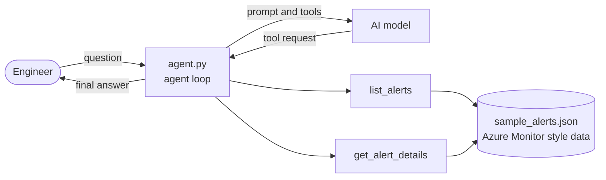

# Azure Monitoring Assistant

A small, **read-only AI agent** that investigates Azure Monitor style alerts, correlates related signals, and produces an incident-style summary with a likely root cause and prioritized next steps.


> **Note:** This project uses **fictional sample data** (`sample_alerts.json`). It contains no real company, tenant, or customer information.

## What it does

- Lets an AI model decide which tools to call to investigate alerts
- Filters alerts by severity, status, and environment
- Correlates related alerts (for example, a failing APIM gateway causing an unhealthy Front Door origin)
- Returns a structured summary: **Summary, Likely root cause, Recommended next steps**

## Architecture



**Design highlights**

| Area | Approach |
|:--|:--|
| Safety | Read-only tools only, no infrastructure changes |
| Loop control | Hard limit of 8 steps to prevent runaway loops |
| Grounding | System prompt requires answers based on tool results only |
| Error handling | Tool errors are returned to the model instead of crashing |
| Observability | Every tool call is logged to the console |

## Run it

1. Install dependencies

   ```bash
   pip install -r requirements.txt
   ```

2. Set your API key (never commit it)

   ```bash
   export ANTHROPIC_API_KEY="your-key-here"
   ```

3. Run the agent

   ```bash
   python agent.py
   python agent.py "Which prod alerts are Sev1 and what is the likely root cause?"
   ```

## Example output

```text
[step 1] tool: list_alerts {"environment": "prod", "status": "Fired"}
[step 2] tool: get_alert_details {"alert_id": "ALR-1002"}
[step 3] tool: get_alert_details {"alert_id": "ALR-1006"}

Summary: ...
Likely root cause: ...
Recommended next steps: ...
```

## Project structure

```text
azure-monitoring-agent/
├── agent.py             # agent loop and tools
├── sample_alerts.json   # fictional Azure Monitor style alerts
├── requirements.txt
└── README.md
```

## Roadmap

- [ ] Replace sample data with live Log Analytics queries using KQL (read-only, managed identity)
- [ ] Add Azure Workbook links to summaries
- [ ] Add approval step before any remediation action
- [ ] Deploy with Terraform and run on a schedule with GitHub Actions
